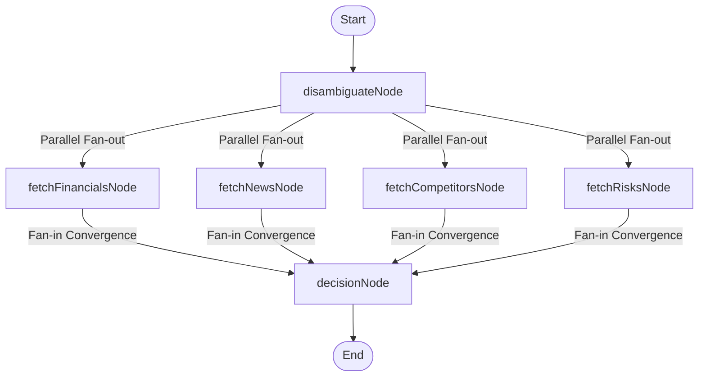

# 🎯 AlphaLens: AI-Powered Investment Research Agent

AlphaLens is an agentic AI investment research engine that automatically analyzes companies, extracts financials, scores news sentiment, evaluates competitive positioning, assesses risks, and synthesizes a structured investment recommendation. It leverages **LangGraph**, **Groq (Llama-3.1-8b-instant)**, **Yahoo Finance**, and **DuckDuckGo** to provide real-time reasoning and insights.

---

## 🚀 Overview

AlphaLens automates the equity research pipeline. When you input a company or ticker, the agent:
1. **Resolves & Disambiguates**: Determines the correct ticker and official company metadata. If the search is ambiguous, it prompts the user to select the target entity.
2. **Performs Parallel Analysis**:
   - **Financials**: Fetches stats like PE, margins, cashflow, debt, sector, and industry.
   - **Market Sentiment**: Analyzes Yahoo Finance & DuckDuckGo news, scoring sentiment (0-100).
   - **Competitive Landscape**: Researches competitors and market position.
   - **Risk Assessment**: Scans operational, regulatory, and financial threat vectors.
3. **Verdict Synthesis**: Consolidates all dimensions to form an expert verdict (`INVEST` | `WATCH` | `PASS`) with supporting rationale and sources.

---

## 🛠️ How to Run It

### Prerequisites
- [Node.js](https://nodejs.org/) (v18 or higher recommended)
- A Groq API Key (or Google Gemini key)

---

### Setup & Run Steps

#### 1. Clone the Repository & Install Root Dependencies
```bash
# Install root package (used to host styled-components configuration)
npm install
```

#### 2. Configure the Backend
Navigate to the `backend` folder, install dependencies, and configure environment variables:
```bash
cd backend
npm install
```

Create a `.env` file in the `backend` directory (a template or active `.env` is already configured in the repo):
```env
# Port the Express server will run on
PORT=3001

# Put your Groq API key here (the agent accepts GROQ_API_KEY, GOOGLE_GENAI_API_KEY, or GOOGLE_API_KEY)
GOOGLE_GENAI_API_KEY=gsk_your_groq_api_key_here
```

Start the backend server in development mode (using nodemon):
```bash
# From the backend directory
npx nodemon src/server.js
```

#### 3. Configure the Frontend
In a new terminal window, navigate to the `frontend` folder, install dependencies, and start the Vite dev server:
```bash
cd frontend
npm install
npm run dev
```

The application will be running locally at `http://localhost:5173`.

---

## 🧠 How It Works

### Approach & Architecture

The core of AlphaLens is designed around a Directed Acyclic Graph (DAG) state machine using **LangGraph**. The workflow graph is compiled as follows:



### Real-Time Streaming (SSE)
- The Express backend handles the research query by running the compiled LangGraph.
- Throughout the execution, we use **Server-Sent Events (SSE)** to stream progress updates, node status, and logs from the backend to the frontend client in real-time.
- The React frontend displays these logs dynamically within the **Reasoning Layer** page, providing complete transparency into the agent's logic.

---

## ⚖️ Key Decisions & Trade-Offs

### What We Chose and Why

1. **Llama-3.1-8b-instant (via Groq)**: 
   - *Why*: Blazing-fast inference speeds (sub-second tokens) which are vital for real-time progress logging, combined with robust JSON parsing capability.
   - *Trade-off*: Slightly weaker general reasoning than larger models like Llama-3-70b or GPT-4o, but mitigated by highly structured prompt engineering and localized retrieval.
2. **Server-Sent Events (SSE)**:
   - *Why*: Unidirectional (server-to-client) streaming is a perfect fit for progress logs and dimension streaming. It is simpler than WebSockets, supports auto-reconnection out of the box, and works over standard HTTP protocols.
3. **No-Dependency Styling for custom components**:
   - *Why*: We bypassed libraries like `styled-components` in our loader and search box components, choosing instead to write vanilla CSS inside `<style>` blocks. This resolved monorepo React hook conflicts, shaved 25+ kB from the bundle, and avoided version pollution.

### What We Left Out
- **SEC Edgar Filing OCR/Parser**: We opted not to include a full PDF parser for 10-K/10-Q filings to keep the agent fast and avoid external API dependencies (like SEC-API).
- **Persistent Database**: Saved history is currently persisted in the browser's `localStorage` rather than a centralized database to maintain a lightweight, serverless-friendly footprint.

---

## 📈 Example Runs

### 🟢 NVIDIA Corporation (Ticker: `NVDA`)
* **Verdict**: **INVEST** (High Confidence)
* **Rationale**: NVIDIA continues to dominate the AI hardware ecosystem with its H100/H200 and upcoming Blackwell architecture. Financial metrics show a massive operating margin exceedance (>60%) and exponential year-over-year revenue growth.
* **Risks**: Supply-chain bottlenecks (reliance on TSMC) and potential impact of US export restrictions to key foreign markets.

### 🟡 Apple Inc. (Ticker: `AAPL`)
* **Verdict**: **WATCH** (High Confidence)
* **Rationale**: Strong ecosystem lock-in, stable services division growth, and aggressive share buyback programs anchor the valuation. However, hardware cycle upgrades (iPhone) remain stagnant.
* **Risks**: Antitrust and regulatory pressures in the EU and US, and intense smartphone competition in China.

---

## 🛠️ What We Would Improve With More Time

1. **Multi-Agent Debates**: Setup a multi-agent framework where a bull-analyst agent and a bear-analyst agent debate the financial model before the synthesizer makes the final decision.
2. **Financial Modeling Integrations**: Dynamically calculate Discounted Cash Flow (DCF) models using historical Yahoo Finance statistics instead of relying solely on LLM judgment.
3. **Vector Embeddings on Company Reports**: Incorporate RAG (Retrieval-Augmented Generation) on recent earnings call transcripts and brokerage research papers for deeper qualitative context.
